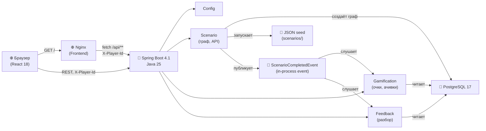
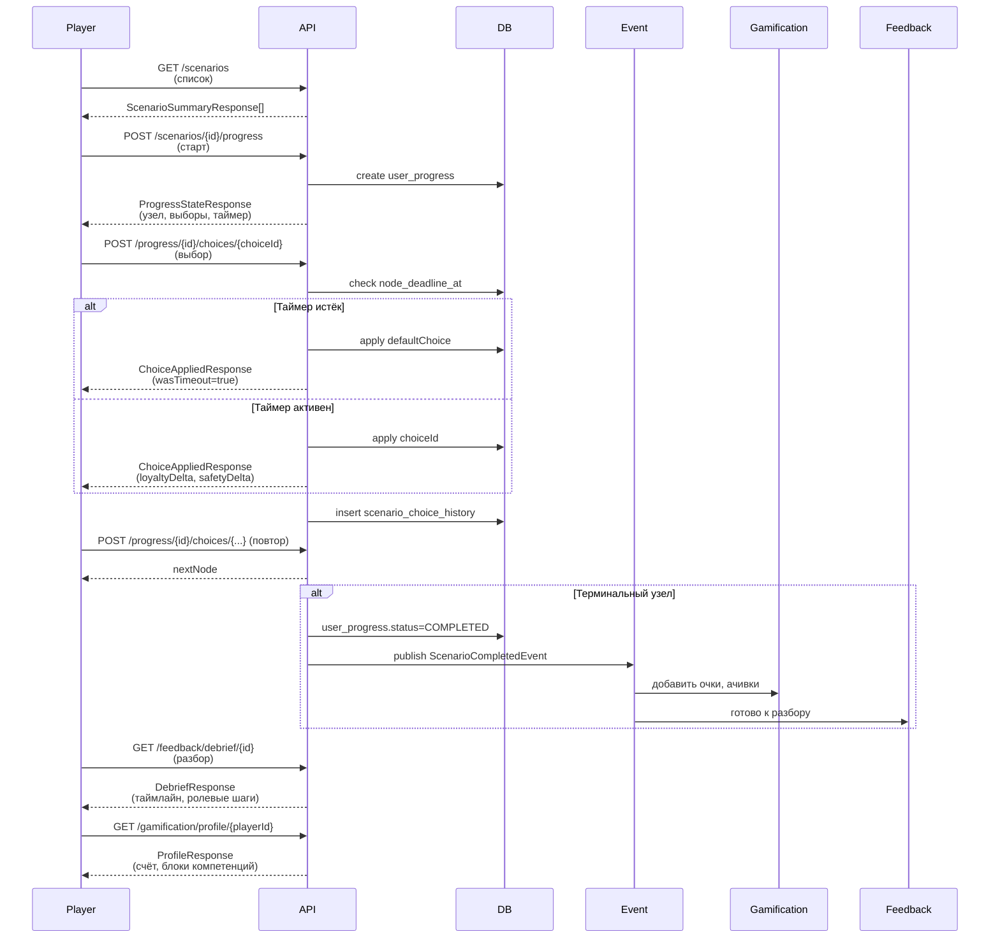

# ВСМ — тренажёр проводника

Геймифицированный тренажёр для проводников высокоскоростного поезда (Москва — Санкт-Петербург): нелинейные
сценарии общения с пассажирами с таймерами, две шкалы («лояльность пассажира» / «рейтинг безопасности»),
ачивки, лидерборд, обучающий разбор решений.

- `backend/` — Spring Boot монолит (Java 25, REST на виртуальных потоках).
- `frontend/` — React 18 без сборки (UMD + Babel standalone с CDN), демо-статика раздаётся тем же backend'ом.
- `mobile/` — Android-приложение, разрабатывается отдельно.

## Запуск

### Вариант 1: всё через Docker Compose (backend + Postgres + nginx frontend)

```bash
docker compose -f compose.yaml up --build
```

(на машине с `DOCKER_DEFAULT_PLATFORM` в окружении — обычно `env -u DOCKER_DEFAULT_PLATFORM docker compose up --build`).

Поднимает Postgres 17, backend-контейнер (API) и frontend-контейнер (nginx) — открывать
`http://localhost:3000/`. Backend доступен на `http://localhost:8080/api/**` и `http://localhost:8080/swagger-ui.html`.

### Вариант 2: локально, backend через `bootRun`, frontend через docker

```bash
docker compose -f compose.yaml up -d postgres frontend   # Postgres + nginx frontend
cd backend && ./gradlew bootRun                          # backend на 8080
```

Frontend на `http://localhost:3000/`, backend API на `http://localhost:8080/api/**`.

### Вариант 3: разработка с Vite dev-сервером на фронте

Backend поднят варианта 1 или 2 (порт 8080). Отдельно — Vite dev-сервер для `frontend/` на порту 3000:

```bash
cd frontend && npm install && npm run dev
```

Открывать адрес, который выведет `npm run dev` (обычно `http://localhost:5173` или `http://localhost:3000`).
Запросы к `/api/**` проксируются на `http://localhost:8080` через конфиг Vite (`vite.config.ts`).

### Карта портов

| Сервис | Порт по умолчанию | Как переопределить |
|---|---|---|
| frontend (nginx) | `3000` | `FRONTEND_HOST_PORT` (хост-порт в `compose.yaml`) |
| backend (REST/Swagger) | `8080` | `SERVER_PORT` (внутри контейнера/JVM) / `BACKEND_HOST_PORT` (хост-порт в `compose.yaml`) |
| Postgres | `5432` | `POSTGRES_HOST_PORT` (хост-порт в `compose.yaml`) |

Все три — только хост-порты (внутри Docker-сети контейнеры всегда слушают штатные 3000/8080/5432); нужны,
только если порт уже занят на хост-машине.

### Адреса

- Приложение (Docker): `http://localhost:3000/` (nginx frontend)
- Swagger UI: `http://localhost:8080/swagger-ui.html`
- OpenAPI JSON: `http://localhost:8080/v3/api-docs`
- REST API: `http://localhost:8080/api/**` (см. Swagger UI для контрактов)
- Actuator: `http://localhost:8080/actuator/**`

### Тесты

```bash
cd backend && ./gradlew test
```

Использует Testcontainers (Postgres) — нужен доступный Docker.

## Архитектура

Система построена как модульный монолит на Spring Boot 4.1 с разделением по доменам: сценарный движок (scenario), геймификация (gamification) и обучающая обратная связь (feedback). Сценарии — графы узлов и выборов, сохранённые в PostgreSQL; данные загружаются идемпотентно из JSON-seed при запуске приложения.

### Компонентная архитектура



**Описание**: браузер открывает фронтенд на nginx (порт 3000), который статические файлы приложения (React, HTML, CSS). Фронтенд отправляет запросы к REST API Backend (порт 8080) с заголовком `X-Player-Id` для идентификации игрока (без Spring Security). Backend экспортирует API и свою диагностику (Swagger, Actuator). Сценарный движок управляет графом узлов и выборов, загружая их из JSON-файлов при старте; при завершении сценария публикует доменное событие `ScenarioCompletedEvent` в памяти (in-process), на которое отписаны gamification и feedback. Gamification начисляет очки и ачивки, feedback строит разбор решений по истории выборов. Все данные в PostgreSQL, миграции через Liquibase.

### Сценарий прохождения



**Детали**: игрок открывает список сценариев, выбирает один и начинает его (отправляя `X-Player-Id` в заголовке). Сервер создаёт запись `user_progress` и возвращает первый узел с доступными выборами. На каждый выбор сервер проверяет, не истёк ли сервисный дедлайн (`node_deadline_at`); если истёк — применяется `defaultChoice` узла (поведение при таймауте). При терминальном узле прохождение переходит в `COMPLETED`, публикуется событие, и gamification/feedback получают уведомление. Затем игрок может посмотреть разбор решений (какие шаги ролевой модели соблюдены/пропущены, какие были лучшие альтернативы) и обновить профиль.

## API и пользовательский сценарий

### Таблица эндпоинтов

| Метод | Путь | Назначение | Параметры |
|---|---|---|---|
| **Сценарии** | | | |
| `GET` | `/api/scenarios` | Список всех сценариев | `block?` (фильтр по блоку) |
| `GET` | `/api/scenarios/{scenarioId}` | Один сценарий | — |
| **Прохождение** | | | |
| `POST` | `/api/scenarios/{scenarioId}/progress` | Начать сценарий | Header: `X-Player-Id` |
| `GET` | `/api/scenarios/progress/{progressId}` | Текущий узел | Header: `X-Player-Id` |
| `POST` | `/api/scenarios/progress/{progressId}/choices/{choiceId}` | Выбрать вариант | Header: `X-Player-Id` |
| `POST` | `/api/scenarios/progress/{progressId}/timeout` | Применить таймаут | Header: `X-Player-Id` |
| **Разбор** | | | |
| `GET` | `/api/feedback/debrief/{userProgressId}` | Разбор прохождения | — |
| **Профиль игрока** | | | |
| `GET` | `/api/gamification/profile/{playerId}` | Профиль (счёт, ачивки) | — |
| `GET` | `/api/gamification/leaderboard` | Лидерборд | `limit=20`, `playerId?` |
| `GET` | `/api/gamification/achievements` | Каталог ачивок | `playerId?` |

### Пример прохождения (curl)

Генерируем UUID для игрока (или используем существующий):

```bash
PLAYER_ID="550e8400-e29b-41d4-a716-446655440000"
API_URL="http://localhost:8080"

# 1. Список сценариев
curl -s "$API_URL/api/scenarios" | jq '.[0]'

# Запомните scenarioId первого сценария, например:
SCENARIO_ID="550e8400-e29b-41d4-a716-446655440001"

# 2. Начать сценарий
PROGRESS=$(curl -s -X POST "$API_URL/api/scenarios/$SCENARIO_ID/progress" \
  -H "X-Player-Id: $PLAYER_ID" | jq .)
PROGRESS_ID=$(echo "$PROGRESS" | jq -r '.progressId')

# 3. Получить текущий узел (с выборами)
curl -s "$API_URL/api/scenarios/progress/$PROGRESS_ID" \
  -H "X-Player-Id: $PLAYER_ID" | jq '.currentNode'

# 4. Сделать выбор (используйте choiceId из currentNode.choices)
CHOICE_ID="550e8400-e29b-41d4-a716-446655440002"
CHOICE=$(curl -s -X POST \
  "$API_URL/api/scenarios/progress/$PROGRESS_ID/choices/$CHOICE_ID" \
  -H "X-Player-Id: $PLAYER_ID" | jq .)

# 5. Повторять выборы, пока не достигнете терминального узла (status=COMPLETED)

# 6. Разбор решений
curl -s "$API_URL/api/feedback/debrief/$PROGRESS_ID" | jq '.timeline'

# 7. Профиль игрока
curl -s "$API_URL/api/gamification/profile/$PLAYER_ID" | jq '.totalScore'
```

**Swagger UI**: для интерактивного изучения API откройте `http://localhost:8080/swagger-ui.html`

## Ограничения и план развития

### Текущие ограничения в MVP

- **Аутентификация**: отсутствует. Идентификация игрока — простой заголовок `X-Player-Id` (UUID). Применимо только для дружественной сессии в одном браузере; при публичном доступе нужна реальная аутентификация и авторизация через Spring Security.
- **Таймер**: синхронизирован через серверный дедлайн (`node_deadline_at` в REST-ответе), а не через WebSocket-пуш. Клиент пересчитывает остаток каждую секунду от `Date.now()`. Это работает, но требует синхронизации часов браузер↔сервер; при большом расхождении может привести к срыву таймаута.
- **Сложность сценариев**: реализованы все 51 сценарий — 8 флагманских (3–4 уровня ветвления) + 43 простых (1 развилка, 3 варианта).
- **Уведомления**: отсутствуют. Игрок не получает напоминаний о новых сценариях или персональных челленджах.
- **Аналитика компетенций**: нет глубокого анализа пробелов в знаниях. Профиль показывает raw очки по блокам, но не выделяет, какие типы ситуаций проходят плохо (например, "медицина: успешность 60%").
- **Мобильное приложение**: разрабатывается отдельно (Android, Kotlin + Compose). Web и мобильное приложение используют один backend.

### План развития

**Фаза 1 (завершение MVP)**:
- Добавить оставшиеся 17 сценариев (простые, по одной развилке на блок).
- Расширить систему ачивок (полнота ролевых шагов, включение МГН в сложность).

**Фаза 2 (UX и интеграция)**:
- Заменить REST-синхронизацию таймера на WebSocket (Reactor, `Flux`/`Sinks`).
- Добавить Spring Security с простой аутентификацией (например, OAuth2 против ВСМ-системы, если будет).
- Реализовать систему уведомлений (в-приложение и/или email, по выбору).

**Фаза 3 (аналитика и редактирование)**:
- Добавить REST-эндпоинт аналитики: "сценарии по проблемным компетенциям".
- Встроить редактор сценариев (UI для изменения графа узлов/выборов и рассеивания на лету).
- Синхронизировать мобильное приложение с backend через тот же REST API.

**Фаза 4 (масштабирование)**:
- Перейти на Kafka для асинхронных событий (при нескольких экземплярах backend).
- Добавить Redis-кэш для списка сценариев и лидерборда.
- Реализовать интеграцию с системой управления обучением ВСМ (LMS), если потребуется.
