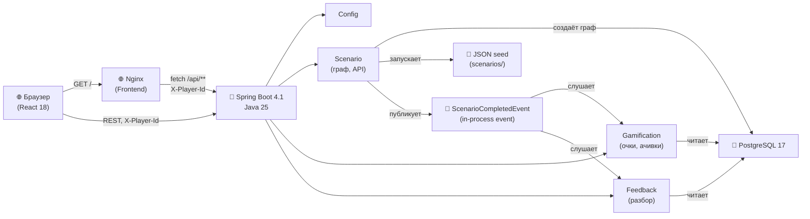
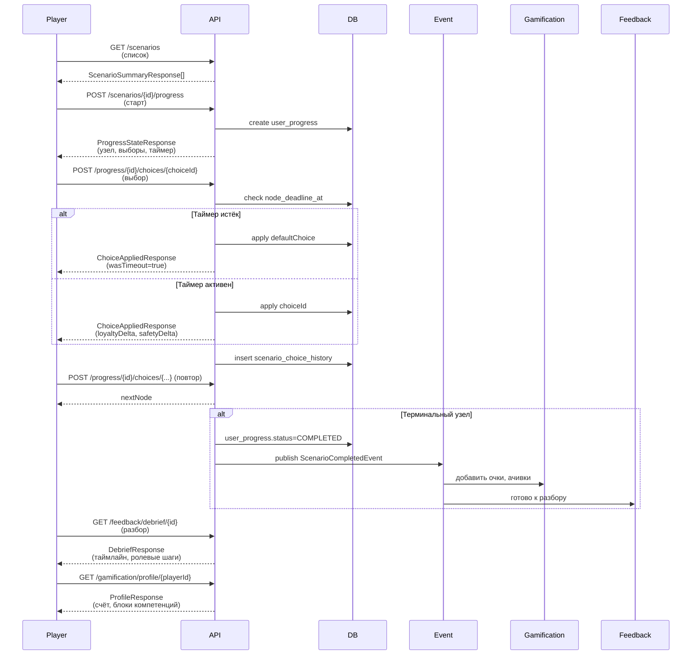

# ВСМ — тренажёр проводника

Геймифицированный тренажёр для проводников высокоскоростного поезда (Москва — Санкт-Петербург): нелинейные
сценарии общения с пассажирами с таймерами, две шкалы («лояльность пассажира» / «рейтинг безопасности»),
ачивки, лидерборд, обучающий разбор решений.

- `backend/` — Spring Boot монолит (Java 25, REST на виртуальных потоках).
- `frontend/` — React 18 без сборки (UMD + Babel standalone с CDN), демо-статика раздаётся тем же backend'ом.
- `mobile/` — Android-приложение, разрабатывается отдельно.

## Запуск

### Вариант 1: всё через Docker Compose (backend + Postgres + nginx frontend)

```bash
docker compose -f compose.yaml up --build
```

(на машине с `DOCKER_DEFAULT_PLATFORM` в окружении — обычно `env -u DOCKER_DEFAULT_PLATFORM docker compose up --build`).

Поднимает Postgres 17, backend-контейнер (API) и frontend-контейнер (nginx) — открывать
`http://localhost:3000/`. Backend доступен на `http://localhost:8080/api/**` и `http://localhost:8080/swagger-ui.html`.

### Вариант 2: локально, backend через `bootRun`, frontend через docker

```bash
docker compose -f compose.yaml up -d postgres frontend   # Postgres + nginx frontend
cd backend && ./gradlew bootRun                          # backend на 8080
```

Frontend на `http://localhost:3000/`, backend API на `http://localhost:8080/api/**`.

### Вариант 3: разработка с Vite dev-сервером на фронте

Backend поднят варианта 1 или 2 (порт 8080). Отдельно — Vite dev-сервер для `frontend/` на порту 3000:

```bash
cd frontend && npm install && npm run dev
```

Открывать адрес, который выведет `npm run dev` (обычно `http://localhost:5173` или `http://localhost:3000`).
Запросы к `/api/**` проксируются на `http://localhost:8080` через конфиг Vite (`vite.config.ts`).

### Карта портов

| Сервис | Порт по умолчанию | Как переопределить |
|---|---|---|
| frontend (nginx) | `3000` | `FRONTEND_HOST_PORT` (хост-порт в `compose.yaml`) |
| backend (REST/Swagger) | `8080` | `SERVER_PORT` (внутри контейнера/JVM) / `BACKEND_HOST_PORT` (хост-порт в `compose.yaml`) |
| Postgres | `5432` | `POSTGRES_HOST_PORT` (хост-порт в `compose.yaml`) |

Все три — только хост-порты (внутри Docker-сети контейнеры всегда слушают штатные 3000/8080/5432); нужны,
только если порт уже занят на хост-машине.

### Демо-данные

По умолчанию при запуске backend-контейнера (или `bootRun`) с профилем `demo` автоматически заливаются 12 демо-проводников (UUID с префиксом `00000000-0000-0000-0000-...`) с реалистичными прохождениями сценариев. Это позволяет сразу увидеть непустой лидерборд, статистику админки и аналитику компетенций на защите.

Данные идемпотентны: повторный запуск приложения не дублирует игроков.

**Отключение демо-данных:**

```bash
# Docker Compose: выключить профиль
docker compose -f compose.yaml up --build -e SPRING_PROFILES_ACTIVE=

# Или локально через bootRun
cd backend && SPRING_PROFILES_ACTIVE= ./gradlew bootRun
```

### Адреса

- Приложение (Docker): `http://localhost:3000/` (nginx frontend)
- Swagger UI: `http://localhost:8080/swagger-ui.html`
- OpenAPI JSON: `http://localhost:8080/v3/api-docs`
- REST API: `http://localhost:8080/api/**` (см. Swagger UI для контрактов)
- Actuator: `http://localhost:8080/actuator/**`

### Тесты

```bash
cd backend && ./gradlew test
```

Использует Testcontainers (Postgres) — нужен доступный Docker.

### Покрытие тестами

```bash
cd backend && ./gradlew test jacocoTestReport
```

Отчёт JaCoCo (line/branch, по классам и пакетам) — `backend/build/reports/jacoco/test/html/index.html`,
машиночитаемый — `.../jacocoTestReport.xml`; собирается автоматически после `test` (в том числе
внутри `./gradlew build`), CI загружает html-версию артефактом `backend-coverage-report` на каждый
прогон (не только при падении, в отличие от `backend-test-reports`).

## Архитектура

Система построена как модульный монолит на Spring Boot 4.1 с разделением по доменам: сценарный движок (scenario), геймификация (gamification) и обучающая обратная связь (feedback). Сценарии — графы узлов и выборов, сохранённые в PostgreSQL; данные загружаются идемпотентно из JSON-seed при запуске приложения.

### Компонентная архитектура



**Описание**: браузер открывает фронтенд на nginx (порт 3000), который статические файлы приложения (React, HTML, CSS). Фронтенд отправляет запросы к REST API Backend (порт 8080) с заголовком `X-Player-Id` для идентификации игрока (без Spring Security). Backend экспортирует API и свою диагностику (Swagger, Actuator). Сценарный движок управляет графом узлов и выборов, загружая их из JSON-файлов при старте; при завершении сценария публикует доменное событие `ScenarioCompletedEvent` в памяти (in-process), на которое отписаны gamification и feedback. Gamification начисляет очки и ачивки, feedback строит разбор решений по истории выборов. Все данные в PostgreSQL, миграции через Liquibase.

### Сценарий прохождения



**Детали**: игрок открывает список сценариев, выбирает один и начинает его (отправляя `X-Player-Id` в заголовке). Сервер создаёт запись `user_progress` и возвращает первый узел с доступными выборами. На каждый выбор сервер проверяет, не истёк ли сервисный дедлайн (`node_deadline_at`); если истёк — применяется `defaultChoice` узла (поведение при таймауте). При терминальном узле прохождение переходит в `COMPLETED`, публикуется событие, и gamification/feedback получают уведомление. Затем игрок может посмотреть разбор решений (какие шаги ролевой модели соблюдены/пропущены, какие были лучшие альтернативы) и обновить профиль.

## API и пользовательский сценарий

### Таблица эндпоинтов

| Метод | Путь | Назначение | Параметры |
|---|---|---|---|
| **Авторизация** (см. ниже) | | | |
| `POST` | `/api/auth/register` | Регистрация | JSON: `login`, `email`, `password`, `displayName?`; Header: `X-Player-Id?` (см. ниже) |
| `POST` | `/api/auth/login` | Вход, выдаёт токен | JSON: `login`, `password` |
| `GET` | `/api/auth/me` | Текущий профиль по токену | Header: `Authorization: Bearer <token>` |
| **Вход через Госуслуги** (демо-заглушка, см. ниже) | | | |
| `GET` | `/api/auth/esia/authorize` | HTML-страница выбора тестового гражданина | `redirect_uri` |
| `GET` | `/api/auth/esia/select` | Редирект на `redirect_uri?code=...` (шаг внутри страницы выше) | `redirect_uri`, `citizen` |
| `POST` | `/api/auth/esia/callback` | Обменять код на токен, как `/api/auth/login` | JSON: `code` |
| **Сценарии** | | | |
| `GET` | `/api/scenarios` | Список всех сценариев | `block?` (фильтр по блоку) |
| `GET` | `/api/scenarios/{scenarioId}` | Один сценарий | — |
| **Прохождение** | | | |
| `POST` | `/api/scenarios/{scenarioId}/progress` | Начать сценарий | Header: `X-Player-Id` или `Authorization: Bearer <token>`; `carClass?` (см. ниже) |
| `GET` | `/api/scenarios/progress/{progressId}` | Текущий узел | Header: `X-Player-Id` или `Authorization: Bearer <token>` |
| `POST` | `/api/scenarios/progress/{progressId}/choices/{choiceId}` | Выбрать вариант | Header: `X-Player-Id` или `Authorization: Bearer <token>` |
| `POST` | `/api/scenarios/progress/{progressId}/timeout` | Применить таймаут | Header: `X-Player-Id` или `Authorization: Bearer <token>` |
| `WS` | `/ws/progress/{progressId}` | Живой таймер/шкалы (см. ниже) | Query: `playerId` или `token` |
| **Экзамен** (см. ниже) | | | |
| `POST` | `/api/exams` | Создать экзамен (10 сценариев из разных блоков) | Header: `X-Player-Id` или `Authorization: Bearer <token>`; `carClass?`, `size?` |
| `GET` | `/api/exams/{examId}` | Прогресс/итог экзамена | Header: `X-Player-Id` или `Authorization: Bearer <token>` |
| `POST` | `/api/exams/{examId}/current` | Начать текущий непройденный пункт экзамена | Header: `X-Player-Id` или `Authorization: Bearer <token>` |
| **Редактор сценариев** (роль ADMIN, см. ниже) | | | |
| `POST` | `/api/editor/scenarios/validate` | Проверить граф без сохранения | JSON — формат seed-файла; Header: `Authorization: Bearer <admin-token>` |
| `POST` | `/api/editor/scenarios` | Создать/обновить сценарий | JSON — формат seed-файла; Header: `Authorization: Bearer <admin-token>` |
| `GET` | `/api/editor/scenarios/{code}` | Экспорт сценария для правки | Header: `Authorization: Bearer <admin-token>` |
| `GET` | `/api/editor/template` | Шаблон нового сценария | Header: `Authorization: Bearer <admin-token>` |
| **Разбор** | | | |
| `GET` | `/api/feedback/debrief/{userProgressId}` | Разбор прохождения (`409`, если это пункт незавершённого экзамена — см. ниже) | — |
| **Профиль игрока** | | | |
| `GET` | `/api/gamification/profile/{playerId}` | Профиль (счёт, ачивки) | — |
| `GET` | `/api/gamification/leaderboard` | Лидерборд | `limit=20`, `playerId?` |
| `GET` | `/api/gamification/achievements` | Каталог ачивок | `playerId?` |
| `GET` | `/api/gamification/notifications` | Уведомления игрока | `playerId`, `unreadOnly=false` |
| `POST` | `/api/gamification/notifications/{id}/read` | Отметить уведомление прочитанным | — |
| `POST` | `/api/gamification/notifications/read-all` | Отметить все прочитанными | `playerId` |
| `GET` | `/api/gamification/challenges` | Активные челленджи месяца с прогрессом (см. ниже) | `playerId?` |
| **Командный рейтинг** (см. ниже) | | | |
| `GET` | `/api/gamification/teams` | Каталог команд с числом участников | — |
| `POST` | `/api/gamification/teams/{id}/join` | Вступить в команду (смена команды разрешена) | Header: `X-Player-Id` или `Authorization: Bearer <token>` |
| `GET` | `/api/gamification/leaderboard/teams` | Рейтинг команд по среднему баллу участника | — |
| **Статистика для админки** (роль ADMIN, см. ниже) | | | |
| `GET` | `/api/admin/stats/overview` | Сводка по всем игрокам и прохождениям | Header: `Authorization: Bearer <admin-token>` |
| `GET` | `/api/admin/stats/scenarios` | Статистика по каждому сценарию | Header: `Authorization: Bearer <admin-token>` |
| `GET` | `/api/admin/stats/blocks` | Агрегат по блокам ситуаций | Header: `Authorization: Bearer <admin-token>` |
| `GET` | `/api/admin/stats/{scenarios,blocks,players,teams}.csv` | Те же и ещё 2 отчёта (игроки, команды) в CSV для Excel (см. ниже) | Header: `Authorization: Bearer <admin-token>` |

### Формат ошибок

Любая ошибка REST API (валидация, доменное правило, невалидные параметры, неизвестный путь,
Spring Security, необработанное исключение) — JSON одной формы:

```json
{
  "error": "progress_already_completed",
  "message": "Прохождение '...' уже завершено (COMPLETED)",
  "details": ["строка/поле: причина", "..."],
  "timestamp": "2026-09-26T09:00:00Z",
  "path": "/api/scenarios/progress/.../choices/..."
}
```

`error` — стабильный машиночитаемый код (см. таблицу типичных значений ниже), `details` —
опциональный список уточнений (список проблем графа сценария у `invalid_graph`/`invalid_markdown`,
поля с ошибками валидации у `validation_failed`) и отсутствует в JSON, когда для ошибки достаточно
одного `message`.

| `error` | HTTP | Когда |
|---|---|---|
| `validation_failed` | 400 | Тело запроса не прошло проверку полей (`details` — список `поле: причина`) |
| `bad_request` | 400 | Параметр/путь не того типа (например, невалидный UUID), обязательный параметр не передан, тело не распознано |
| `not_found` | 404 | Путь не смэплен ни на один эндпоинт |
| `method_not_allowed` | 405 | Путь существует, но не для этого HTTP-метода |
| `unauthorized` | 401 | Нет `Authorization: Bearer` там, где он обязателен (см. «Авторизация» ниже) |
| `access_denied` | 403 | Токен есть, но не той роли |
| `internal_error` | 500 | Необработанное исключение — стек трассировки только в серверном логе |
| остальные (`scenario_not_found`, `progress_already_completed`, `invalid_graph`, `invalid_markdown`, `login_already_taken`, ...) | по контексту | Доменные правила конкретного модуля — коды стабильны, форма ответа для них та же, что и выше |

### Авторизация

Идентификация игрока по-прежнему может быть анонимной — заголовок `X-Player-Id` с любым UUID,
сгенерированным клиентом, работает без учётной записи, как и раньше (см. предыдущий раздел
«Текущие ограничения в MVP» — это осталось верным для анонимного пути). Учётная запись поверх
этого — опциональна:

- `POST /api/auth/register` — тело `{"login", "email", "password", "displayName"}`, ответ 201 с
  профилем без пароля (`{"id", "login", "email", "displayName", "role", "verified", "createdAt"}`).
  `verified` — подтверждена ли личность (пока выставляется только входом через Госуслуги, см. ниже;
  обычная регистрация логином/паролем всегда даёт `false`).
  Уже занятый `login`/`email` — `409` (`login_already_taken`/`email_already_taken`).
  Если передать заголовок `X-Player-Id` с UUID уже накопленной анонимной сессии, этот UUID
  становится `id` новой учётной записи — весь прогресс/очки, начисленные анонимно на этот id,
  остаются доступны без переноса данных (id общий для всех доменов приложения). Если этот UUID уже
  принадлежит другой учётной записи — `409 player_already_registered`.
- `POST /api/auth/login` — тело `{"login", "password"}`, ответ `{"token", "profile"}`. Неверный
  логин/пароль — `401 invalid_credentials` (сообщение одинаковое в обоих случаях, чтобы не
  подсказывать существование логина).
- `GET /api/auth/me` — заголовок `Authorization: Bearer <token>`, тот же формат профиля, что у
  `register`. Без токена или с невалидным/просроченным — `401 invalid_token`.
- Токен — JWT (HS256, `app.auth.jwt.secret`/`app.auth.jwt.expiration-minutes`, по умолчанию 24
  часа). На игровых эндпоинтах (`/api/scenarios/**`) и WebSocket `Authorization: Bearer <token>`
  (или `?token=` в query для WebSocket) — альтернатива `X-Player-Id`: playerId берётся из токена.
  Если запрос прислал оба способа и они указывают на разных игроков — побеждает токен. Невалидный
  токен равносилен его отсутствию (откат на `X-Player-Id`/`playerId`, не ошибка).
- Роли: дефолтная учётная запись администратора создаётся при старте из
  `app.auth.admin.login`/`app.auth.admin.password` (сменить эти значения в проде, см. переменные
  окружения в `compose.yaml`). Редактор сценариев (`/api/editor/**`) и статистика для админки
  (`/api/admin/**`) требуют роль `ADMIN` — валидный `Authorization: Bearer <token>` с этой ролью
  (получить его может только сам администратор через `/api/auth/login`; обычная регистрация всегда
  создаёт роль `USER`). Без токена — `401 unauthorized`, с токеном роли `USER` — `403
  access_denied`; оба ответа — тот же единый JSON-формат ошибок, что и везде в API (см. «Формат
  ошибок» выше), а не HTML/plain text по умолчанию от Spring Security. Игровые эндпоинты
  (`/api/scenarios/**`, `/ws/**`), `/api/auth/**`, Swagger и actuator ролей не требуют — доступны
  как раньше, с токеном или без. Свойство `app.auth.admin-protection-enabled` (по умолчанию
  `true`, env `APP_AUTH_ADMIN_PROTECTION_ENABLED`) временно возвращает `/api/editor/**` и
  `/api/admin/**` к открытому доступу без токена — например, для демо до того, как в клиенте
  появится экран логина; независимо от `app.editor.enabled` (тот решает, существует ли редактор
  вообще, а не кто имеет к нему доступ, см. раздел «Редактор сценариев» ниже).

### Вход через Госуслуги (заглушка)

Настоящая интеграция с ЕСИА (единой системой идентификации и аутентификации Госуслуг) за время
хакатона невозможна: она требует регистрации информационной системы в ЕСИА (недели согласования),
собственных сертификатов по ГОСТ Р 34.10-2012 и лицензированного крипто-провайдера (например,
КриптоПро CSP — обычная TLS-библиотека JVM для этого протокола не подходит), доступа к тестовой
среде ЕСИА и, для боевого контура, отдельного соглашения с Минцифры. Вместо этого — демонстрационная
заглушка: фиктивный OAuth2/OIDC-подобный провайдер внутри самого backend, повторяющий форму потока
(authorization code), но не протокол ЕСИА.

Поток (гейтится `app.esia.mock.enabled`, по умолчанию `true`; `false` — все три пути ниже отвечают
`404`, как обычный незамапленный путь):

1. `GET /api/auth/esia/authorize?redirect_uri=<url>` — HTML-страница «Госуслуги (демо)» без
   брендинга/логотипов настоящего портала, с явной пометкой «демонстрационная заглушка» и списком
   из 4 фиксированных тестовых граждан (ФИО + маскированный СНИЛС).
2. Выбор гражданина на странице — переход на `GET /api/auth/esia/select?redirect_uri=...&citizen=...`,
   который отвечает `302` на `redirect_uri?code=<одноразовый код>` (код живёт 5 минут, действует один раз,
   хранится только в памяти процесса).
3. `POST /api/auth/esia/callback` с телом `{"code"}` — обменивает код на учётную запись и токен,
   ответ **того же формата**, что `POST /api/auth/login` (`{"token", "profile"}`). Учётная запись
   для тестового гражданина находится или создаётся (id гражданина фиксирован — повторный вход тем
   же гражданином возвращает ту же учётную запись, а не плодит новые) и помечается `verified=true`.
   Неизвестный/просроченный/уже использованный код — `400 invalid_or_expired_esia_code`.

Что нужно для реальной интеграции вместо этой заглушки: регистрация информационной системы в ЕСИА
(портал поставщиков информации Госуслуг), сертификаты и ключи по ГОСТ Р 34.10-2012 для подписи
запросов, крипто-провайдер с поддержкой ГОСТ (КриптоПро CSP или аналог — стандартный `java.security`
провайдер JVM их не реализует), доступ к тестовой среде ЕСИА для отладки, и OAuth2/OIDC-клиент со
scope `openid fullname snils` (профильные данные гражданина) вместо текущего мок-эндпоинта.

`verified` в профиле — задел под будущий антифрод (см. `PlayerVerificationService.isVerified`,
пакет `auth`): сейчас метод существует, но нигде не влияет на начисление очков/ачивок — это
отдельная задача домена геймификации.

### WebSocket: живой таймер и шкалы

`ws://<host>/ws/progress/{progressId}?playerId=<uuid>` (или `?token=<jwt>` вместо `playerId` —
см. «Авторизация» выше) — обычный WebSocket (не STOMP), для узлов
с таймером и мгновенных обновлений шкал без опроса REST. REST остаётся источником истины и
работает без WebSocket: клиент без подключения просто продолжает опрашивать
`GET /api/scenarios/progress/{progressId}`, а просроченный дедлайн всё равно обрабатывается на
любом REST-выборе после него.

Владелец проверяется так же, как в REST (`playerId` должен совпадать с владельцем прохождения) —
иначе сервер закрывает соединение (`1008 Policy Violation`). Сервер шлёт JSON-события одного
формата с полем `type`:

| `type` | Когда | Ключевые поля |
|---|---|---|
| `state` | Сразу после подключения (снимок текущего состояния), и после любого применённого выбора (REST или серверный `timeout` ниже) | `status`, `loyaltyScore`, `safetyScore`, `currentNode` |
| `tick` | Раз в секунду, только пока текущий узел под активным таймером | `secondsRemaining` |
| `timeout` | Сервер сам применил `defaultChoice` узла по истечении дедлайна — без запроса клиента | `appliedChoiceId`, `appliedChoiceCode`, `loyaltyDelta`, `safetyDelta`, `status`, `finalOutcome`, `currentNode` |
| `completed` | Дополнительно к последнему `state`, когда прохождение перешло в `COMPLETED` | те же поля, что у `state`/`timeout` |

Поля, не относящиеся к конкретному `type`, в сообщении отсутствуют (не сериализуются как `null`).
Серверный автотаймаут использует ту же блокировку прохождения, что и REST — конкурентный REST-выбор
и автотаймаут не дублируют друг друга, кто раньше применился, тот и в силе.

### Портрет пассажира: класс вагона

Один и тот же сценарий и один и тот же выбор проводника по-разному влияют на лояльность
пассажира в зависимости от класса вагона ВСМ (СТО РЖД 03.011: Стандарт/Комфорт/Бизнес/Первый) —
чем выше класс, тем выше базовые ожидания пассажира.

- `POST /api/scenarios/{scenarioId}/progress?carClass=FIRST` — необязательный query-параметр,
  одно из `STANDARD` (по умолчанию) / `COMFORT` / `BUSINESS` / `FIRST`. Не ломает старых клиентов:
  без параметра поведение то же, что и раньше (`STANDARD`, множитель ×1.0). Класс фиксируется один
  раз при создании прохождения и не меняется до его завершения — повторный `start` уже начатого
  (`IN_PROGRESS`) прохождения с другим `carClass` его игнорирует.
- Модификатор применяется только к дельте **лояльности** (не безопасности — она объективна и от
  класса вагона не зависит): множитель для отрицательной дельты растёт с классом (пассажир прощает
  меньше), множитель для положительной — падает (качественный сервис в высоком классе — ожидаемая
  норма, а не приятный сюрприз). Точная таблица — `STANDARD` ×1.0/×1.0, `COMFORT` ×1.15/×0.9,
  `BUSINESS` ×1.3/×0.85, `FIRST` ×1.5/×0.8 (первое число — множитель ухудшения, второе —
  улучшения). Применяется до клампинга шкалы на `[0, 100]`; в ответе (`loyaltyDelta`) — уже
  фактически применённая величина, честная для разбора прохождения.
- `carClass` прохождения возвращается в `ProgressStateResponse`/`ChoiceAppliedResponse` (поле
  `carClass`) — для отображения на экране прохождения и в разборе.
- Опционально узел графа может переопределять вводный текст (`text`) по классу вагона
  (`passengerPortraits` в seed-формате, ключ — код класса) — например, тот же пассажир в вагоне
  «Первого» класса формулирует ту же просьбу сдержаннее. Если для класса переопределения нет,
  используется обычный текст узла. Реализовано для сценария `boarding-no-ticket` (узел `start`,
  классы `FIRST`/`STANDARD`) как образец для остальных сценариев.

### Режим экзамена

Проверка знаний без подсказок: подряд, без прерывания, проходится набор из нескольких сценариев,
и только по итогам всех выставляется единая оценка — вместо того чтобы игрок видел эффект каждого
решения по ходу (как в обычной тренировке) и мог подстроиться под "правильный" ответ методом проб.

- `POST /api/exams?size=10&carClass=STANDARD` — создаёт экзамен: `size` (по умолчанию 10) активных
  сценариев из **разных блоков** датасета, 2-3 из которых — флагманские (многоуровневые); порядок
  прохождения перемешан. `carClass` — единый "портрет пассажира" (см. выше) для всех сценариев
  этого экзамена. Ответ — `ExamResponse`: список пунктов по порядку (`scenarios[]`, каждый —
  `scenarioId`/`block`/`title`/`flagship`/статус), `currentIndex` (первый непройденный), `result`
  (`null`, пока экзамен не завершён).
- `POST /api/exams/{examId}/current` — начинает (или возвращает уже начатое) прохождение текущего
  непройденного пункта; дальше игрок ходит по нему **обычными** эндпоинтами прохождения
  (`POST /api/scenarios/progress/{id}/choices/{choiceId}`, `.../timeout`) — экзамен не вводит
  отдельный протокол выбора.
- **Без подсказок**: пока прохождение отмечено как часть экзамена, `ChoiceAppliedResponse`
  каждого выбора не раскрывает `loyaltyDelta`/`safetyDelta`/`loyaltyScore`/`safetyScore` (поля
  отсутствуют в JSON) — игрок не видит, как выбор повлиял на шкалы, до конца экзамена. Навигация
  (`status`, `finalOutcome`, `nextNode`) раскрывается как обычно, иначе прохождение было бы
  невозможно продолжить. Живой WebSocket-канал (`/ws/progress/{id}`) той же логике подчиняется —
  эти поля отсутствуют и там.
- `GET /api/exams/{examId}` — прогресс по каждому пункту; когда все пункты пройдены, `result`
  заполняется: средние `loyaltyScore`/`safetyScore` по пунктам, доля пунктов с исходом `SUCCESS`
  (`successRate`), итоговая оценка `grade` (`EXCELLENT`/`GOOD`/`SATISFACTORY`/`UNSATISFACTORY`,
  пороги — javadoc `ExamGrade`: безопасность — определяющий фактор, выше "удовлетворительно" не
  подняться при средней безопасности `< 60` независимо от лояльности и доли успехов) и
  `weakBlocks` — блоки, где сценарий не завершился `SUCCESS`, от худшего к менее слабому.
- **Разбор во время экзамена недоступен** — `GET /api/feedback/debrief/{userProgressId}` для
  пункта незавершённого экзамена отвечает `409` (не подсказывать уже пройденный пункт, пока
  экзамен идёт); после завершения экзамена целиком разбор каждого пункта открывается как обычно.
- Обычные (не экзаменационные) прохождения не затронуты: те же эндпоинты, тот же полный набор
  полей в ответе выбора, что и раньше.
- **Очки за экзамен** начисляются отдельно от очков за отдельные сценарии (см. «Начисление очков
  и антифрод» выше: пункты экзамена очков не приносят) — фиксированный бонус по итоговой оценке,
  один раз при завершении экзамена целиком: `EXCELLENT` — 300, `GOOD` — 150, `SATISFACTORY` — 50,
  `UNSATISFACTORY` — 0. Оценка `EXCELLENT` дополнительно выдаёт ачивку «Сертификат». Оба начисления
  идемпотентны по экзамену — повторная доставка сигнала о завершении одного и того же экзамена не
  начисляет бонус/ачивку дважды.

### Редактор сценариев

Позволяет добавить новую ситуацию (или отредактировать существующую) без пересборки приложения —
один и тот же JSON-формат, что и у seed-файлов в `backend/src/main/resources/scenarios/*.json`
(верхний уровень: `code`, `situationRef`, `block`, `title`, `description`, `flagship`, `version`,
`entryNode`, `nodes[]`; узел: `code`, `type` — `DIALOGUE`/`ESCALATION`/`TERMINAL`, `text`,
`timerSeconds?`, `defaultChoice?`, `terminal`, `terminalOutcome?`, `outcomeSummary?`,
`hiddenFromPassenger?` — узел закадровой коммуникации (например, служебная рация): решение не
долетает до пассажира, влияет только на шкалы — разбор прохождения показывает это явно вместо
того, чтобы полагаться на эвристику по дельтам узла (по умолчанию `false`),
`passengerPortraits?` — переопределение `text` по классу вагона (см. «Портрет пассажира» выше),
ключ — `STANDARD`/`COMFORT`/`BUSINESS`/`FIRST`, `choices[]`; выбор: `code`, `text`, `loyaltyDelta`,
`safetyDelta`, `target` — код узла или `null`, `roleSteps` — `{acknowledge, rule, solution,
reassure}`, `explanationKey?`, `explanation?`, `normRef?`, `sortOrder`).

- `GET /api/editor/template` — шаблон простого сценария (вводный узел с 3 вариантами → 3
  терминальных узла) как отправная точка.
- `POST /api/editor/scenarios/validate` — проверяет граф (существование `entryNode`/`target`/
  `defaultChoice`, обязательность выборов у нетерминальных узлов, достижимость всех узлов из
  `entryNode`, наличие хотя бы одного достижимого терминального узла) и возвращает
  `{"valid": bool, "errors": [...]}` — без сохранения.
- `POST /api/editor/scenarios` — валидирует и сохраняет: новый `code` создаёт сценарий (201),
  уже существующий обновляет граф (200), если по сценарию ещё не было ни одного прохождения.
  Если прохождения уже есть — `409 scenario_has_playthroughs` (обновление графа сценария с
  историей запрещено намеренно, чтобы не порвать разбор уже пройденных игр). Сохранённый
  сценарий сразу доступен в `GET /api/scenarios` и проходим через API прохождения. Ошибки графа
  — `400 invalid_graph`, список проблем в `details` (см. «Формат ошибок» выше), не одна строка.
- `GET /api/editor/scenarios/{code}` — экспорт существующего сценария в том же формате, для
  правки в редакторе (round-trip: экспортированный JSON снова принимается `POST /scenarios`).
- `POST /api/editor/scenarios/import-markdown?save=false|true` — импорт ситуации из простого
  markdown-формата вместо JSON (см. «Импорт из markdown» ниже).

Включается свойством `app.editor.enabled` (по умолчанию `true`) — существует ли редактор вообще
(`false` полностью убирает эндпоинты, `404` вместо `401`/`403`). Доступ к включённому редактору
требует роль `ADMIN` (см. раздел «Авторизация» выше) — оба флага независимы: `app.editor.enabled`
решает "есть ли редактор", `app.auth.admin-protection-enabled` — "нужен ли для него токен".

#### Импорт из markdown

Альтернатива JSON seed-формату для человека, который пишет содержание ситуации, а не JSON:
`POST /api/editor/scenarios/import-markdown` принимает тело как сырой `text/markdown`, так и
`application/json` вида `{"markdown": "..."}` (различаются по первому символу тела, не по
заголовку `Content-Type`).

Формат — построчный, пустые строки только разделяют блоки:

```
# Заголовок ситуации
Код: my-scenario-code
Блок: safety
Описание: краткое описание (опционально)
Флагман: да|нет (опционально, по умолчанию нет)
Версия: 1 (опционально, по умолчанию 1)
Начальный узел: start (опционально, по умолчанию — код первого узла)

## start
Тип: ESCALATION (опционально, по умолчанию DIALOGUE; игнорируется, если ниже есть "Итог:")
Скрыт от пассажира: да (опционально, по умолчанию нет — см. hiddenFromPassenger выше)
Текст узла — реплика или описание ситуации, одна или несколько строк.

- [код-варианта] текст варианта -> целевой-узел (лояльность +N, безопасность -M)
> Пояснение: почему этот вариант хорош/плох (опционально)
> Норма: ссылка на норматив (опционально)
> Шаги: признать, правило, решение, заверить (опционально, любое подмножество через запятую)

Таймер: 30 с, по умолчанию: код-варианта (опционально, только у узлов с вариантами)

## terminal-node
Текст терминального узла (используется и как outcomeSummary для разбора).
Итог: SUCCESS|PARTIAL|FAILURE
```

Не поддерживает `passengerPortraits` — для этого нужен обычный JSON-формат. Вариант без цели
(`target` = `null`, конец сценария сразу после выбора) — просто без `-> целевой-узел`.

Ответ:

- ошибки самой разметки (строка не распознана, не хватает обязательных `Код:`/`Блок:`, битый
  формат варианта/эффекта на шкалы) — сразу `400 invalid_markdown`, `details` — список
  `"12: <причина>"` (номер строки и причина, см. «Формат ошибок» выше); ссылки между узлами
  (`target`, достижимость) на этом шаге не проверяются;
- если разметка разобрана, граф всегда проверяется тем же `ScenarioGraphValidator`, что и
  `POST /scenarios`:
  - `save=false` (по умолчанию) — ничего не сохраняется, ответ `{"scenario": <seed JSON>,
    "errors": [...]}` — тот же JSON seed-формат для предпросмотра/правки перед сохранением,
    `errors` — проблемы графа (пусто, если можно сохранять);
  - `save=true` — проблемы графа сразу дают `400 invalid_graph` (как у `POST /scenarios`),
    иначе сценарий сохраняется тем же `ScenarioSeedService.upsertForEditor`, что и обычный JSON
    (создание — 201, обновление — 200, конфликт с уже пройденным сценарием — 409).

### Статистика для админки

Только чтение, без записи, роль `ADMIN` (см. раздел «Авторизация» выше) — источник данных
для будущей административной панели.

- `GET /api/admin/stats/overview` — всего игроков и прохождений (`totalPlaythroughs`, из них
  `completedPlaythroughs`/`inProgressPlaythroughs`), средние итоговые шкалы лояльности/
  безопасности по завершённым прохождениям, доли `SUCCESS`/`PARTIAL`/`FAILURE` среди завершённых
  (`successRate`/`partialRate`/`failureRate`, 0 при отсутствии завершённых), число уникальных
  активных игроков за последние 24 часа и 7 дней (`activePlayers24h`/`activePlayers7d`).
- `GET /api/admin/stats/scenarios` — по каждому сценарию хотя бы с одним прохождением:
  число прохождений, `successRate`, средние шкалы (по завершённым), `timeoutRate` — доля
  выборов, применённых автоматически по истечении таймера, среди всех выборов по сценарию.
  Список отсортирован по возрастанию `successRate` — самые "проваливаемые" сценарии первыми.
- `GET /api/admin/stats/blocks` — тот же набор метрик, агрегированный по блоку ситуаций
  (boarding/baggage/safety/seating/comfort/catering/medical/lost_found/conflict/misc).

На пустой базе (или для сценария/блока без единого прохождения) эндпоинты возвращают нули и
пустые списки, а не ошибку.

#### Экспорт в CSV

Каждый из 4 отчётов (сценарии, блоки, игроки, команды) доступен в CSV по тому же пути с
суффиксом `.csv` (`GET /api/admin/stats/scenarios.csv`, `/blocks.csv`, `/players.csv`,
`/teams.csv`) — та же роль `ADMIN`, тот же токен:

- `players.csv` — по каждому игроку хотя бы с одним прохождением: `playerId`, `displayName`,
  `team` (пусто, если игрок не состоит в команде), `totalScore`, `totalPlaythroughs`,
  `successRate`, средние `avgLoyaltyScore`/`avgSafetyScore`, `lastActivity`.
- `teams.csv` — тот же рейтинг команд, что и `GET /api/gamification/leaderboard/teams`.

Формат подобран под открытие в Excel с русской региональной настройкой, а не под общий
RFC 4180: `Content-Type: text/csv; charset=UTF-8`, разделитель полей — `;` (запятая в русской
локали уже занята как десятичный разделитель, иначе Excel разложит строку не по тем столбцам),
файл начинается с UTF-8 BOM (без него Excel эвристически определяет кодировку и почти всегда
ошибается на кириллице). Значения, содержащие `;`, `"` или перевод строки, оборачиваются в
кавычки с удвоением внутренних кавычек — стандартное экранирование CSV.

### Челленджи месяца

Дополнительная краткосрочная цель поверх обычного начисления очков: игровая механика,
привязанная к календарному месяцу, с наградой в виде очков и, опционально, ачивки.

- Каталог заполняется автоматически при старте приложения на текущий календарный месяц —
  переход на новый месяц заводит новый набор челленджей без релиза, старые остаются в истории.
- Тип цели (минимум три на старте):
  - **N сценариев блока X без исхода «провал»** — счётчик накопительный, не обязательно подряд;
  - **N сценариев подряд с итоговым рейтингом безопасности не ниже T** — любое прохождение с
    рейтингом ниже порога сбрасывает счётчик;
  - **все 4 шага универсальной ролевой модели ответа в N сценариях** (признать/обозначить
    правило/предложить решение/заверить) — засчитывается прохождение, где по совокупности всех
    сделанных выборов встретились все 4 шага.
- Прогресс обновляется тем же обработчиком события завершения сценария, что и обычное
  начисление очков — идемпотентно: повторная доставка события не засчитывает прогресс дважды.
- При достижении цели: очки-награда добавляются к общему счёту игрока, при наличии
  привязанной ачивки — она выдаётся (один раз на игрока), плюс создаётся уведомление о
  выполнении челленджа (доступно через `/api/gamification/notifications`).
- `GET /api/gamification/challenges?playerId=...` — только активные на текущий момент
  челленджи (период `startsAt`-`endsAt` покрывает "сейчас"), с прогрессом игрока
  (`current`/`targetCount`, `completed`); истёкшие или ещё не начавшиеся в выборку не попадают.
  Без `playerId` — тот же каталог с нулевым прогрессом (просмотр без привязки к игроку).

### Командный рейтинг

Бригады/депо как единица соревнования поверх индивидуального лидерборда: один игрок состоит
не более чем в одной команде, вступление и смена команды — свободные, без ограничений и
подтверждения.

- Каталог команд заполняется автоматически при старте приложения (идемпотентно, по коду
  команды) — фронту ничего сидировать не нужно, достаточно `GET /api/gamification/teams`.
- `POST /api/gamification/teams/{id}/join` — вступление; повторный вызов с другим `id`
  переносит игрока в новую команду (одна строка членства на игрока, не история). Если у игрока
  ещё нет ни одного прохождения (и, соответственно, строки профиля), она создаётся лениво с
  нулевым счётом — команда сразу видна в каталоге с этим участником.
- `GET /api/gamification/leaderboard/teams` — рейтинг, отсортированный по **среднему** баллу
  участника, а не по сумме: сумма даёт незаслуженное преимущество командам с большим составом
  независимо от их результативности, среднее нормирует по размеру. Сумма, число прохождений и
  средняя безопасность (сумма очков безопасности по компетенциям, усреднённая по составу)
  остаются в ответе как вспомогательные метрики экрана, но не влияют на позицию. Команда без
  единого участника попадает в список с нулями по всем метрикам, а не пропадает из выдачи.
- При выходе команды на 1-е место всем её участникам приходит уведомление `TEAM_RANK_UP`
  (доступно через уже существующий `/api/gamification/notifications`).

### Начисление очков и антифрод

Очки за одно прохождение: `base(outcome)` (SUCCESS 100 / PARTIAL 50 / FAILURE 20 — очки за
участие) `+ max(0, loyaltyScore) + max(0, safetyScore) - 5` (штраф, если хоть один выбор применён
по таймеру), не ниже 0. Это "сырое" значение проходит два ограничения, прежде чем попасть в
`profile.totalScore` и лидерборд (компетенции по шкалам ниже ограничениям не подвергаются — это
оценка навыка, а не очки для лидерборда):

- **Множитель неподтверждённости** (`app.gamification.unverified-multiplier`, по умолчанию
  `0.5`) — полные очки только профилю, подтверждённому через демо-вход по Госуслугам (`verified`
  в ответе `/api/auth/register`/`/api/auth/login`/`/api/auth/me`, см. «Вход через Госуслуги»
  выше); обычная регистрация логином/паролем и анонимная игра без учётной записи получают
  дисконтированные очки. Для профиля `demo` (сидированные демо-игроки в лидерборде витрины, у
  которых нет и не может быть входа через Госуслуги) множитель переопределён на `1.0`
  (`application-demo.properties`) — демо-выкладка не занижена искусственно.
- **Суточный потолок** (`app.gamification.daily-points-limit`, по умолчанию `3000` очков на
  игрока за календарные сутки UTC) — против скрипта, гоняющего один сценарий по кругу: очередное
  прохождение довносит только остаток лимита, а не полную сумму, если игрок уже близко к
  потолку. Лимит не блокирует само прохождение (ачивки/прогресс челленджей продолжают
  засчитываться) — обнуляется только прирост очков.
- **Зачётность прохождения** — очки/`scenariosCompleted`/ачивки/прогресс челленджей начисляются
  только за **первое** когда-либо завершённое прохождение конкретного сценария конкретным
  игроком и только **вне режима экзамена**. Повторное прохождение уже завершённого сценария и
  каждый отдельный пункт экзамена по-прежнему можно проходить (тренировка/подготовка), но они не
  приносят очков и не засчитываются в лидерборд/ачивки — иначе один и тот же лёгкий сценарий
  можно было бы фармить бесконечно. Компетенции по шкалам (экран профиля) и разбор решений
  считаются по каждой реальной попытке независимо от этого правила — аналитика должна видеть
  весь путь игрока, а не только зачётные попытки.

### Пример прохождения (curl)

Генерируем UUID для игрока (или используем существующий):

```bash
PLAYER_ID="550e8400-e29b-41d4-a716-446655440000"
API_URL="http://localhost:8080"

# 1. Список сценариев
curl -s "$API_URL/api/scenarios" | jq '.[0]'

# Запомните scenarioId первого сценария, например:
SCENARIO_ID="550e8400-e29b-41d4-a716-446655440001"

# 2. Начать сценарий
PROGRESS=$(curl -s -X POST "$API_URL/api/scenarios/$SCENARIO_ID/progress" \
  -H "X-Player-Id: $PLAYER_ID" | jq .)
PROGRESS_ID=$(echo "$PROGRESS" | jq -r '.progressId')

# 3. Получить текущий узел (с выборами)
curl -s "$API_URL/api/scenarios/progress/$PROGRESS_ID" \
  -H "X-Player-Id: $PLAYER_ID" | jq '.currentNode'

# 4. Сделать выбор (используйте choiceId из currentNode.choices)
CHOICE_ID="550e8400-e29b-41d4-a716-446655440002"
CHOICE=$(curl -s -X POST \
  "$API_URL/api/scenarios/progress/$PROGRESS_ID/choices/$CHOICE_ID" \
  -H "X-Player-Id: $PLAYER_ID" | jq .)

# 5. Повторять выборы, пока не достигнете терминального узла (status=COMPLETED)

# 6. Разбор решений
curl -s "$API_URL/api/feedback/debrief/$PROGRESS_ID" | jq '.timeline'

# 7. Профиль игрока
curl -s "$API_URL/api/gamification/profile/$PLAYER_ID" | jq '.totalScore'
```

**Swagger UI**: для интерактивного изучения API откройте `http://localhost:8080/swagger-ui.html`

## Ограничения и план развития

### Текущие ограничения в MVP

- **Аутентификация**: есть регистрация/логин (JWT) и проверка роли, см. раздел «Авторизация» выше — редактор сценариев и статистика для админки требуют роль `ADMIN`, всё остальное (игровые эндпоинты, `/ws/**`) по-прежнему открыто. Анонимный путь (`X-Player-Id` без учётной записи) продолжает работать для игры — учётная запись не обязательна, если не нужен доступ к админ-функциям.
- **Таймер**: сервер поддерживает и REST (`node_deadline_at` в ответе, клиент сам пересчитывает остаток от `Date.now()`), и WebSocket-пуш (`/ws/progress/{progressId}`, события `tick`/`timeout`/`state`/`completed` — см. раздел API выше). Backend готов, но web-фронтенд ещё не переключён на WebSocket-канал (использует REST-путь); WebSocket доступен уже сейчас для мобильного клиента или последующей доработки веба.
- **Сложность сценариев**: реализованы все 51 сценарий — 8 флагманских (3–4 уровня ветвления) + 43 простых (1 развилка, 3 варианта).
- **Уведомления**: есть (`/api/gamification/notifications`) — новая ачивка, личный рекорд, рост в
  лидерборде, выполнение челленджа месяца. Проактивных напоминаний о новых/незавершённых
  сценариях нет.
- **Аналитика компетенций**: нет глубокого анализа пробелов в знаниях. Профиль показывает raw очки по блокам, но не выделяет, какие типы ситуаций проходят плохо (например, "медицина: успешность 60%").
- **Мобильное приложение**: разрабатывается отдельно (Android, Kotlin + Compose). Web и мобильное приложение используют один backend.

### План развития

**Фаза 1 (завершение MVP)**:
- Добавить оставшиеся 17 сценариев (простые, по одной развилке на блок).
- Расширить систему ачивок (полнота ролевых шагов, включение МГН в сложность).

**Фаза 2 (UX и интеграция)**:
- Переключить web-фронтенд на уже готовый WebSocket-канал таймера (`/ws/progress/{progressId}`, Reactor `Flux`/`Sinks` на backend) вместо клиентского пересчёта от REST-дедлайна.
- Добавить Spring Security с простой аутентификацией (например, OAuth2 против ВСМ-системы, если будет).
- Реализовать систему уведомлений (в-приложение и/или email, по выбору).

**Фаза 3 (аналитика и редактирование)**:
- Добавить REST-эндпоинт аналитики: "сценарии по проблемным компетенциям".
- Встроить редактор сценариев (UI для изменения графа узлов/выборов и рассеивания на лету).
- Синхронизировать мобильное приложение с backend через тот же REST API.

**Фаза 4 (масштабирование)**:
- Перейти на Kafka для асинхронных событий (при нескольких экземплярах backend).
- Добавить Redis-кэш для списка сценариев и лидерборда.
- Реализовать интеграцию с системой управления обучением ВСМ (LMS), если потребуется.
